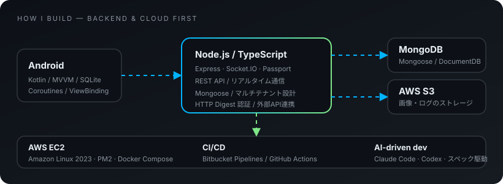

## 👋 About

バックエンド / クラウドを軸に、設計・実装・運用までを一貫して担当しています。

- ☁️ AWS 上の環境構築から CI/CD、保守・バージョンアップまで
- 🤖 Claude Code・Codex を使ったスペック駆動開発

実績・プロジェクトの詳細はポートフォリオにまとめています。

🌐 **Portfolio** → [rimulab.github.io](https://rimulab.github.io/)

---

## 🧭 How I build

  

---

## 🛠 Tech Stack

### 🔥 Main

### 🧩 Also

### 🧰 Daily tools

| 領域 | 内容 |
|---|---|
| **Backend** | Node.js / TypeScript / Express / Socket.IO / Passport.js / Mongoose |
| **Cloud / Infra** | AWS（EC2・S3）/ Docker Compose / PM2 / Amazon Linux |
| **Data** | MongoDB / Amazon DocumentDB / SQLite |
| **CI/CD** | Bitbucket Pipelines / GitHub Actions |
| **Mobile** | Android（Kotlin・MVVM・Coroutines） |
| **Legacy 保守** | PHP（CakePHP・Laravel）/ VB.NET |
| **AI 活用** | Claude Code / Codex / Google Apps Script による自動化 |

---

## 📊 GitHub Stats

